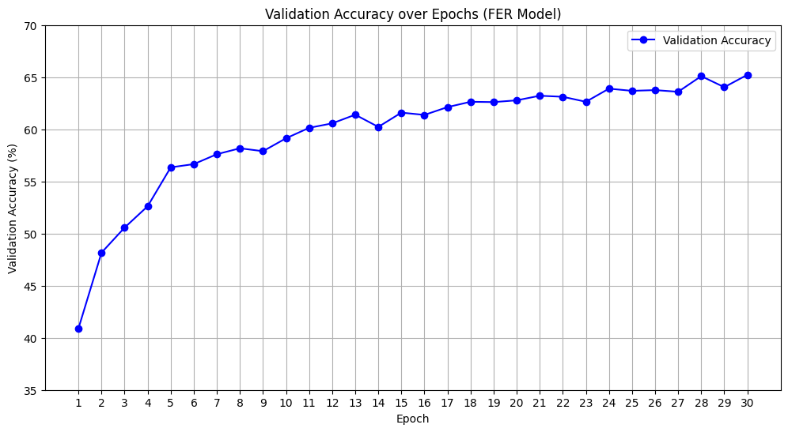

# Facial Expression Recognition (FER) using PyTorch

## 📌 Overview
This project implements a custom Convolutional Neural Network (CNN) using PyTorch to recognize human facial expressions. The model is trained on the popular **FER2013** dataset and classifies grayscale face images into 7 distinct emotional states.

## 📊 Dataset
The model uses the **FER2013** dataset, which is downloaded directly via `kagglehub`. The dataset is split into `train` and `test` folders and contains images for the following 7 classes:
- Angry
- Disgust
- Fear
- Happy
- Neutral
- Sad
- Surprise

## 🛠️ Tech Stack & Libraries
- **Deep Learning Framework:** PyTorch (`torch`, `torchvision`)
- **Data Manipulation:** NumPy
- **Data Visualization:** Matplotlib, Seaborn
- **Evaluation:** Scikit-learn (`confusion_matrix`)

## 🧠 Model Architecture
The custom CNN model (`FERModel`) is built using PyTorch's `nn.Module` and consists of:
- **Feature Extractor:** 6 Convolutional layers (`Conv2d`) paired with `BatchNorm2d`, `ReLU` activations, and `MaxPool2d`.
- **Classifier:** Fully Connected layers (`Linear`) with `Dropout` (0.5) for regularization to prevent overfitting.

## ⚙️ Training Details
- **Loss Function:** `CrossEntropyLoss`
- **Optimizer:** `Adam` (Learning Rate = 0.001)
- **Learning Rate Scheduler:** `StepLR` (step_size=10, gamma=0.1)
- **Data Augmentation:** Grayscale conversion, Random Horizontal Flip, Random Rotation (10 degrees), and Normalization.
- **Batch Size:** 64
- **Epochs:** 30

## 📈 Results
The model was trained for 30 epochs and showed consistent learning.
- **Best Validation Accuracy:** **65.23%**

- 

## 🚀 How to Run
1. Clone this repository.
2. Install the required dependencies:
   ```bash
   pip install torch torchvision seaborn matplotlib scikit-learn numpy kagglehub
